# Controller type

|PLC | PLC | Codesys | ECU |
|:--|:--|:--|:--|
|Modular| Brick|Half-compact|Compact|
||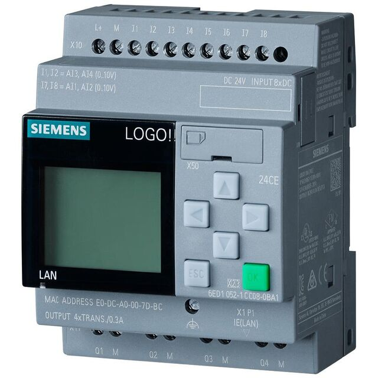|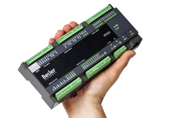| |
|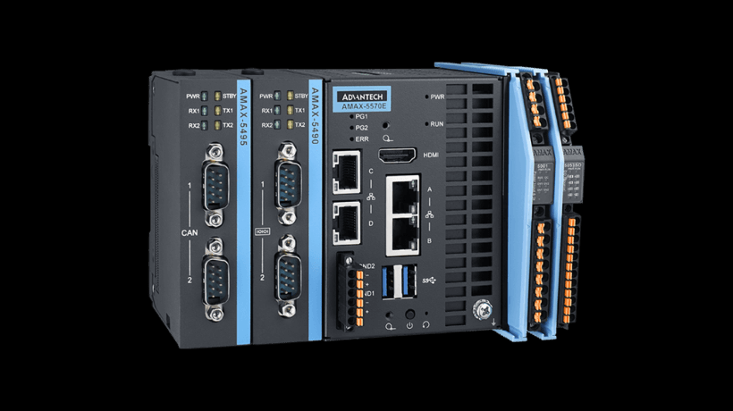|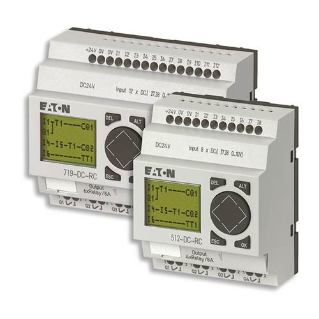|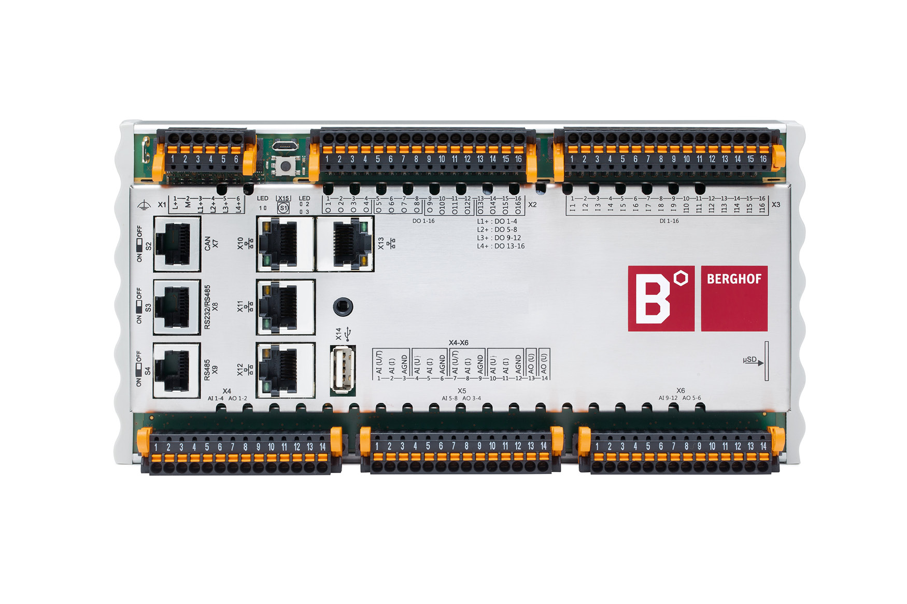|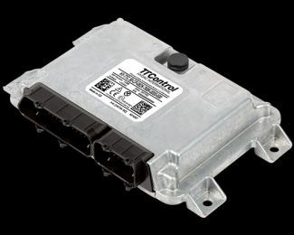|
||||

## Break-out Boxes for Compact Controllers
They integrate directly into existing cabling with a 1.5 m connection cable. The 4 mm safety lab connectors allow the use of conventional measurement equipment and reduce the risk of short circuits. The short-circuit plug jumper enables simultaneous measurements and manipulations. These boxes are available for various controller sizes. For more information and an overview of all available accessories, visit [HYDAC Software](https://software.hydac.com/home/en/produkte/bob-breakout-box/).

|TTC break-out box| what's it?|
|:--|:--|
|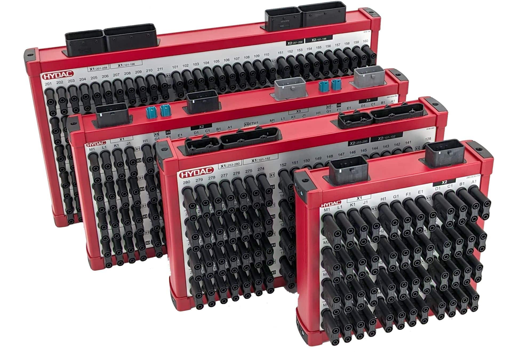|TTC  break-out boxes simplify commissioning and speed up field diagnostics. |
|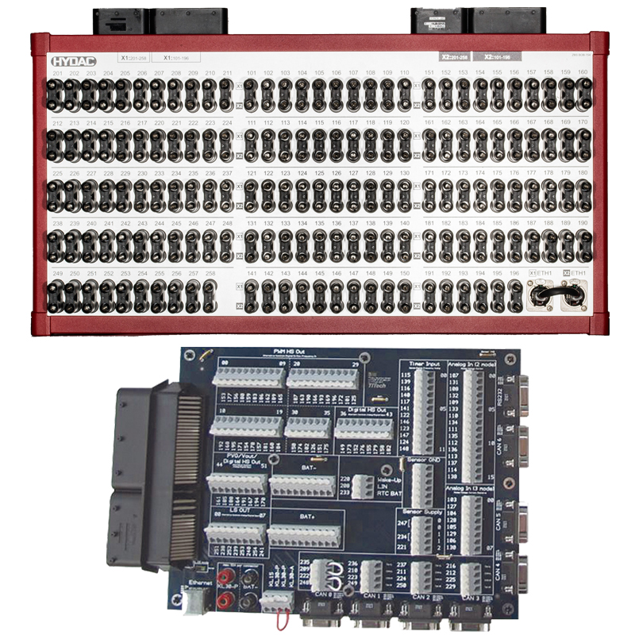 ||
|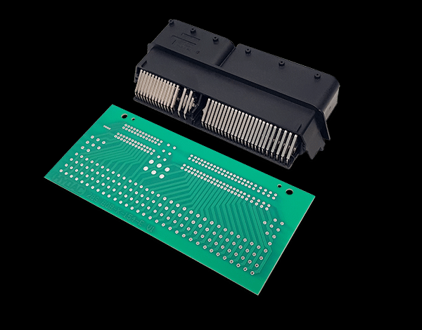||

## Start Kits

|for| what's it?|
|:--|:--|
|codesys controllers|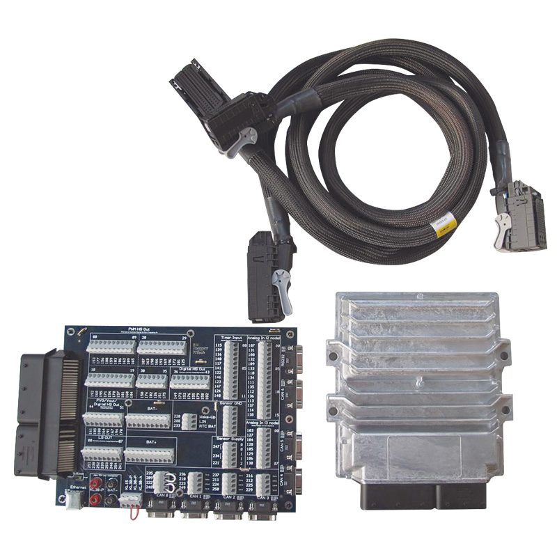 |
|TTC 94 start kit|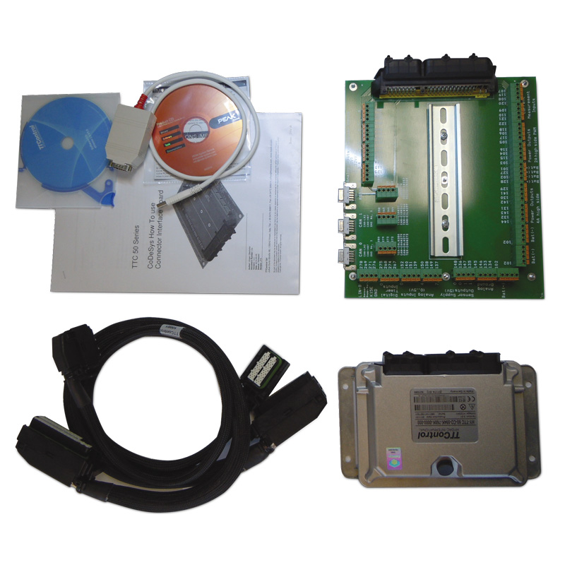|
