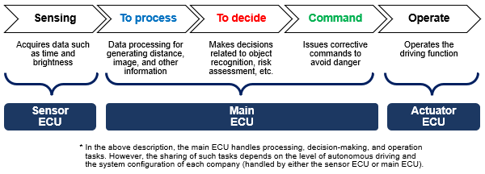

# Looking into Automotive for Inspiration

Reference: https://industrial.panasonic.com/ww/ds/ss/technical/ap1  (Panasonic wants to sell components to car makes)

## Difference between ADAS and AD
**ADAS** stands for advanced driver-assistance systems. The systems aim to improve driving safety by assisting drivers with driving. On the other hand, AD refers to autonomous driving, in which the AD system takes the initiative and drives automatically instead of humans.

Autonomous driving is defined by the **SAE** (Society of Automotive Engineers in the US) as level 0 to 5. From level 0 to 2, driving relies on human drivers, while levels 3 and above allow the driving to be controlled by the vehicle.

## Overall system flow (from sensing to operation)
A sensor ECU, main ECU, and actuator ECU are required to implement ADAS and AD.

Sensor ECU：Senses the surrounding environment, etc. (camera, RADAR, LiDAR, ultrasonic sensor, etc.)
Main ECU：Data processing, decision-making, etc. (ADAS-ECU, AD-ECU, DCU, etc.)
Actuator ECU：Performs and assists the driving operation (accelerator, brake, steering, motor, engine, etc.)

## Two types : Domain and zone types
System configurations for ADAS and AD include a domain type (distributed) and zone type (consolidated).

Domain type: Each function is classified into a group referred to as a domain, and ECUs are consolidated in each domain. Each domain is connected to other domains via the Gateway, and data processing is carried out in each domain ECU.
Zone type: ECUs are consolidated at each key locations in the vehicle body. In addition, a central computer is installed in the center of the system, where data collected from the key locations is processed and handled.
 