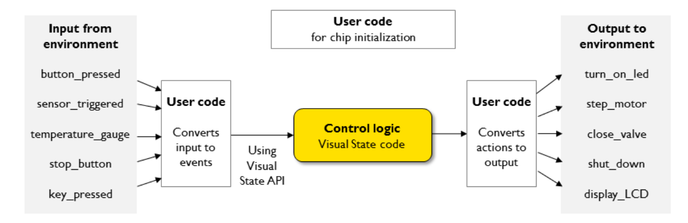
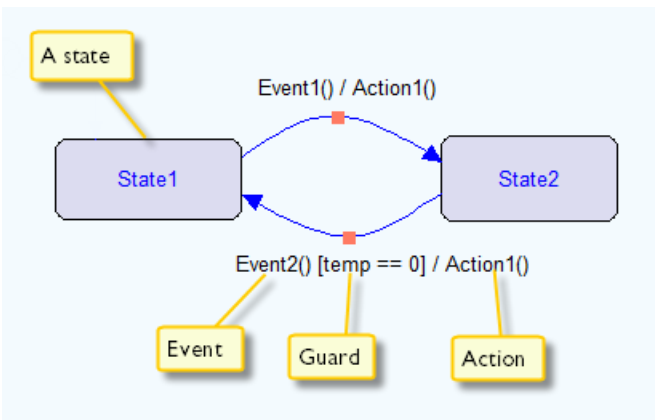
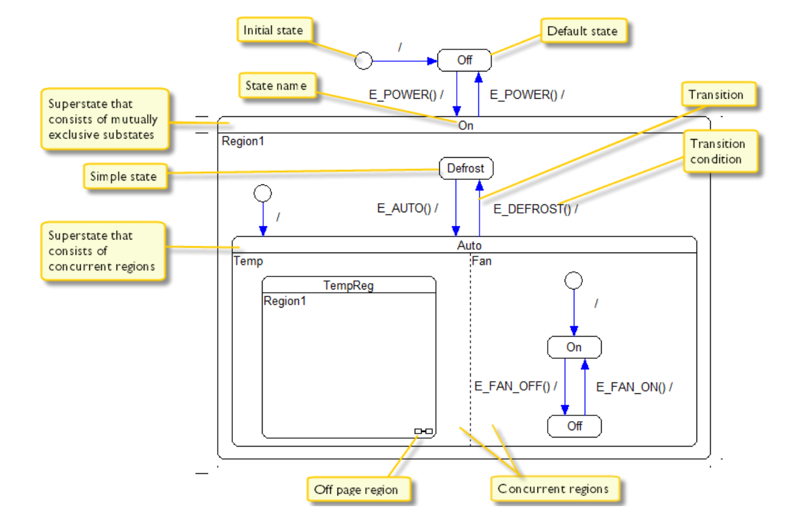

# What is IAR Visual State?

>What iar-vs handles in an embedded application.

1. The externally generated input is processed by the device driver, by way of
interrupts or polling.
2. The driver informs the Visual State runtime execution engine, which acts according
to the state machine model (changes states, executes actions, etc).
3. As a result of the state machine processing, actions (dedicated action functions) that
use device drivers for output can be called.

# 3

## Concepts
1. `Superstate` and `Substate`: A state that in itself contains 1 or more state machines is called a superstate, and states inside an superstate is called a substate.