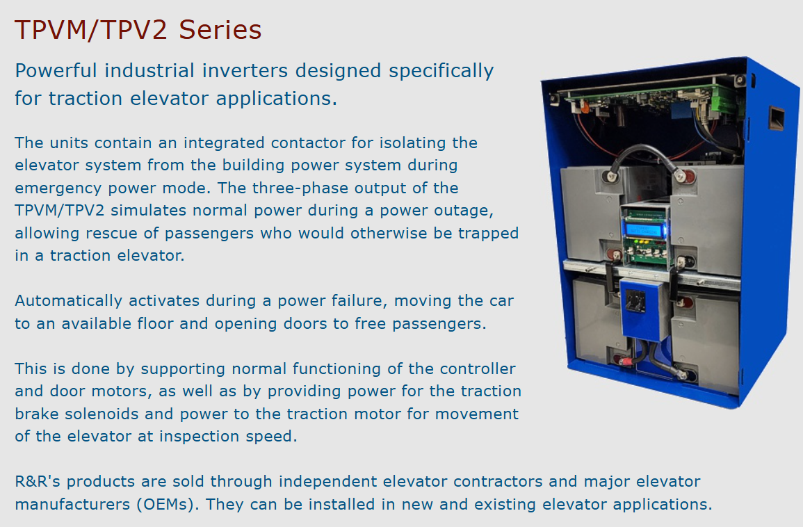

# What is xxx?
2025-04-01 09:54:32  Arthur
## What is Auto Rescue?

It's a box with large `battery`. Automatically it activates during a `power failure`, moving the car to an available floor and opening doors to free passengers.

Ref link: https://www.reynoldselectronics.com/tpv.html

### Model Example
TPV2-480INT-60 
(480V 60Hz)

Link: [pdf sheet](tpv2.pdf).