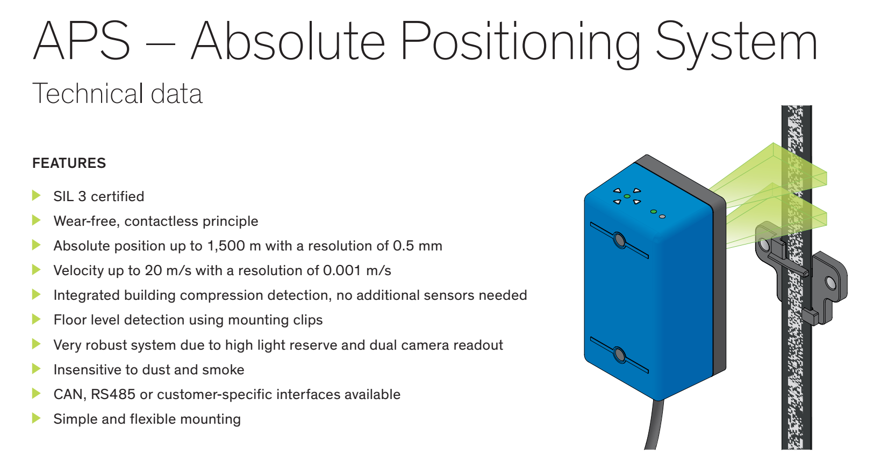
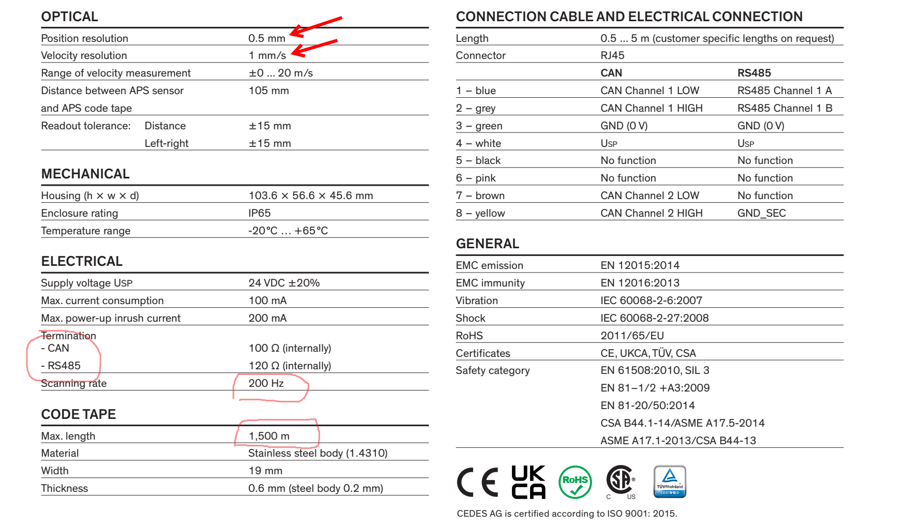
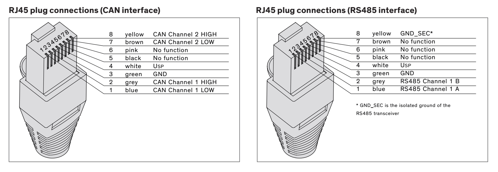

# What is CEDES APS?

- CEDES is a company from Swiss.
- APS = Absolute Positioning System.
- official site: https://www.cedes.com/en/products/aps/ 
- [`datasheet.pdf`](./cedes_aps-datasheet_v41.pdf)
- [`manual for hardware.pdf`](./cedes_aps-manual_v28.pdf)
- [`digest form smartrise, for hardware`](./smartrise-APS-Manual-2.2.pdf)

## It has two types of interface, depending on which you buy.

