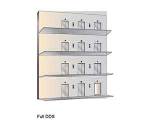

# WHAT IS ELEVATOR GROUP CONTROL (EGS)
1. [1. TOSHIBA GCS](#1-toshiba-gcs)
2. [2. MITSUBISHI ELECTRIC](#2-mitsubishi-electric)
3. [3. HITACHI](#3-hitachi)
4. [4. STEP (CHINA)](#4-step-china)
   1. [Working Principles](#working-principles)
   2. [Elevator Destination Dispatch System (DDS)](#elevator-destination-dispatch-system-dds)

## 1. TOSHIBA GCS
https://www.toshiba-elevator.co.jp/elv/infoeng/products/gcs/

GROUP CONTROL SYSTEMS

[TOSHIBA GROUP CONTROL SYSTEM.PDF](toshiba-groupcontrolsystems_1909.pdf)

## 2. MITSUBISHI ELECTRIC
GROUP CONTROL SYSTEM

[MITSUBISH GROUP CONTROL SYSTEM.PDF](mistsubishi-Elevator_Group_Control_System_EAI-2200C.pdf)

## 3. HITACHI 
GROUP CONTROL ELEVATOR SYSTEM

https://www.hitachi.com/businesses/elevator/products/fibee/index.html

## 4. STEP (CHINA)

http://liftcontrolsystem.com/

Its 'Standard Elevator Group Control System' uses a group controller board. 

### Working Principles
After energized, the main controler of individual elevator will send the hall call button signal to the elevator group control system. The registered hall call signal will then be sent to the landing/indicator board of every floor to acknowledge a landing call and light the call button. If any of the main controllers loses power, the group controller will directly communicate with the call/indicator board, ensuring that the elevator continues to work effeciently under group control. 

If the elevator group control system identifies an elevator which keeps the door open after receiving the allocated hall call signal for long time, the system will cut off that elevator and re-allocate the hall call signals, ensuring the shortest waiting time for the passengers. 

In case that the elevator group control system is broken down, under maintenance, or power off, every single elevator will keep simplex running, and automatically return to the group control mode after the group controller is restored. 

Other functions:
1. Automatic Homming to main floor
2. Disperse car waiting
3. Up peadk service and down peak service 
4. Service floor switched over (service floor schemes)
5. Group split
6. Enforced simplex mode
7. Energy saving mode
8. 

Ref: http://liftcontrolsystem.com/11-5-1-standard-elevator-group-control-system.html 

### Elevator Destination Dispatch System (DDS)
http://liftcontrolsystem.com/11-5-2-elevator-destination-dispatch-system.html

Feature: reduce verage waiting time and long-waiting ratio. 