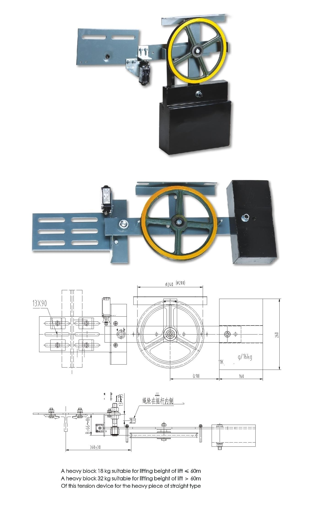

# WHAT IS A TENSION TESTING SENSOR?

REFERENCE LINK: https://www.dinacell.com/en/product/rtm/ 

## ANOTHER TYPE OF TENSION DEVICE

REF LINK: https://www.haitaiqi.com/product/bl240t-tension-device/ 
