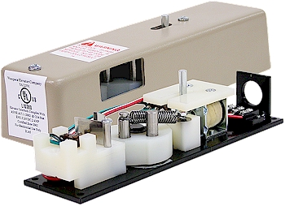

# What is xxx?
2025-03-28 10:50:47  Arthur
## What is interlock?
DOOR INTERLOCK

Electro-mechanical Interlock or EMI, is a safety lock that prevents the hoistway door (hall door) from opening if the elevator is not at that landing.

